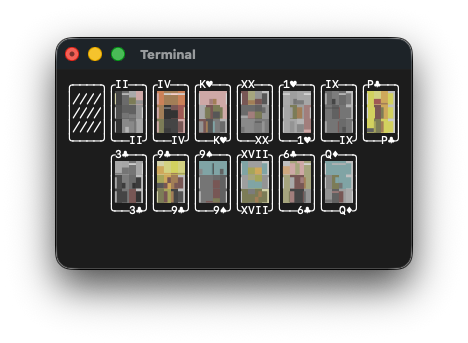
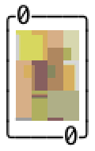

# Tarot TUI

<p align="middle">
  
  
</p>

<table>
  <tr>
    <td style="padding-right: 6px; width: 50px;">
      
    </td>
    <td>
      Made with <a href="https://github.com/charmbracelet/bubbletea">bubbletea</a>. 🧋 <br>
      Rider-Waite-Smith tarot set scaled in ANSI with <a href="https://hpjansson.org/chafa/">chafa</a>.
    </td>
  </tr>
</table>

## Installation

```bash
go install github.com/amilleah/tarot@latest
```

## Getting started

**keybinds:** Use "d" to draw a card, Use "r" to reshuffle.

**mouse-clicks:** Click the deck to draw a card, automatically reshuffles when all cards are drawn. Use "r" to reshuffle as needed.

## Troubleshooting

You'll want to set your terminal's line spacing to 1.0 to avoid gaps within the playing cards.
